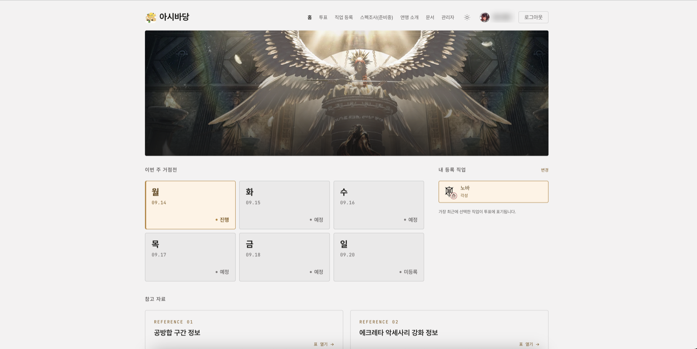
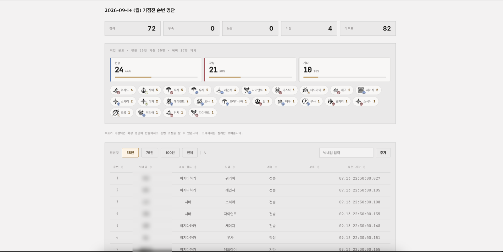
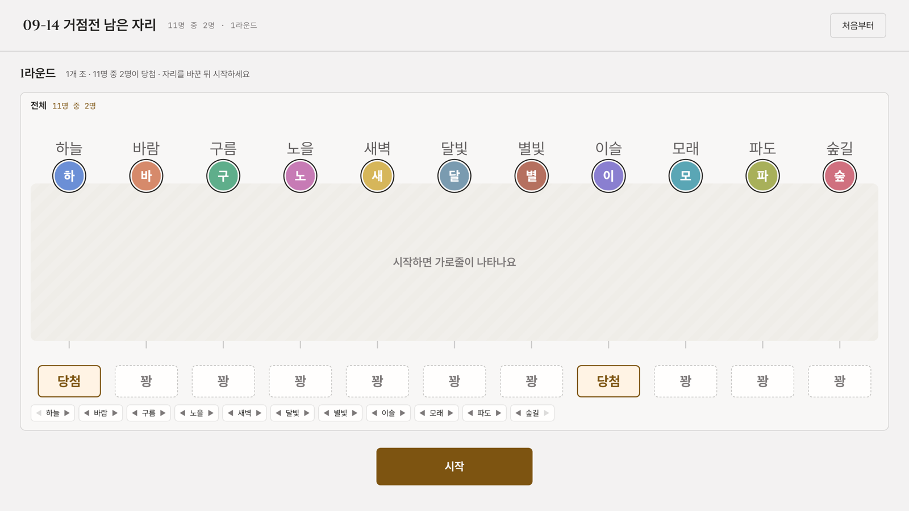
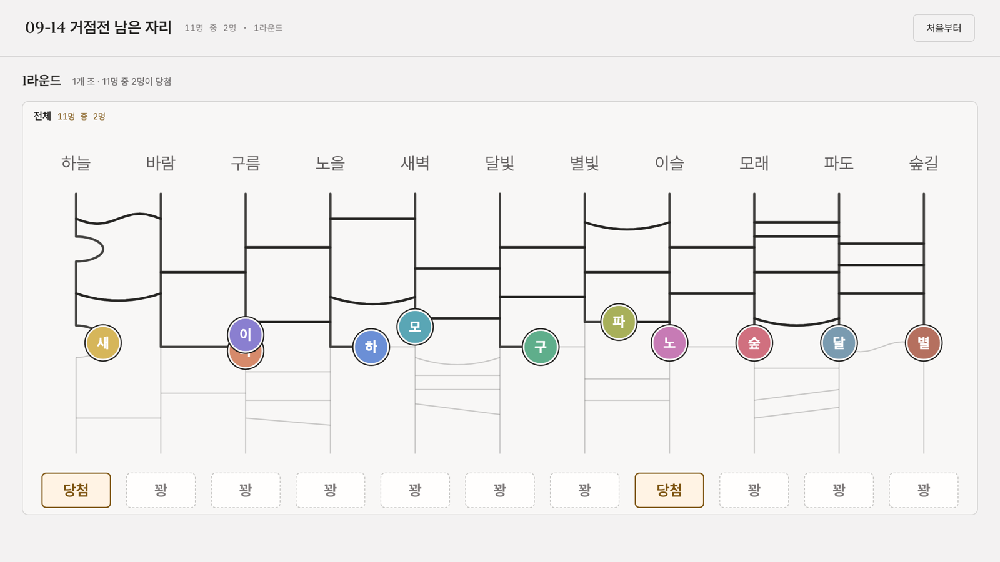
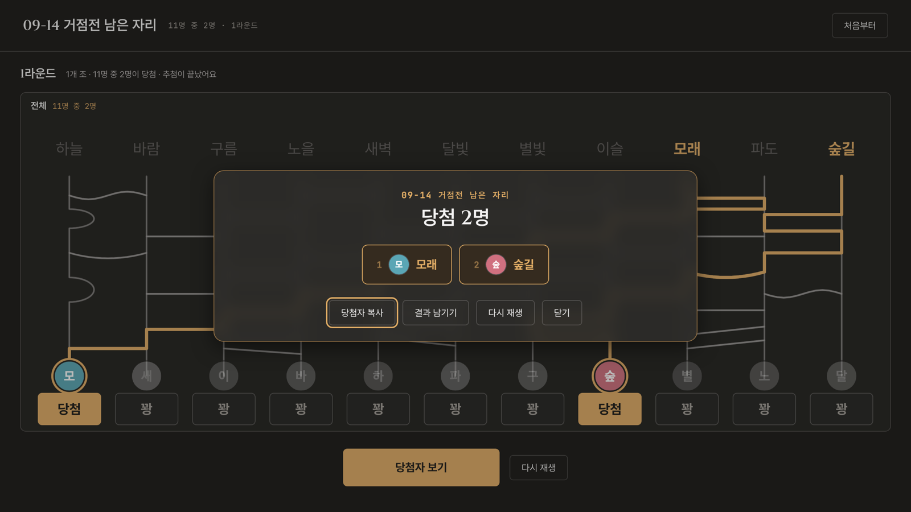

# Union Bot Web

게임 연맹 **아시바당**의 거점전 투표와 운영을 돕는 웹앱입니다. 디스코드 봇(`ashi_bot.py`)의
버튼으로 받던 투표를 웹으로 옮기고, 스펙조사와 추첨 같은 운영 기능을 더했습니다. 봇과 같은
MySQL을 함께 쓰며, 봇의 운영 명령어는 그대로 둡니다.

150명 가까이 한꺼번에 버튼을 누르면 디스코드 API 호출 제한에 걸리던 문제에서 시작했습니다.

## 미리보기

> 추첨 화면은 예시 데이터로 찍었고, 나머지 화면은 실제 화면에서 연맹원 이름을 가렸습니다.

**홈** — 이번 주 거점전 일정과 내가 등록한 직업을 한눈에 봅니다.



**관리자 · 순번 명단** — 참여 인원과 직업 분포를 정원별로 계산해 보여 주고, 투표가 마감되면 확정 명단의 순번을 조정합니다.



**추첨 · 자리 바꾸기** — 당첨 자리는 미리 보여 주고, 가로줄은 시작할 때까지 가립니다.



**추첨 · 사다리 타기** — 사람마다 프로필 사진이 자기 길을 따라 내려가고, 닿는 순간 결과가 열립니다.



**추첨 · 결과** — 사다리 위에 반투명 창으로 당첨자를 띄웁니다. 어두운 테마입니다.



## 주요 기능

- **로그인과 권한** — Discord OAuth2로 로그인합니다. 봇에서 회원 등록을 마친(`user.status = 1`)
  계정만 들어올 수 있고, 디스코드 서버 역할로 관리자를 가립니다.
- **거점전 투표** (`/vote`) — 참여·부속·늦참·미참을 고르고, 참여나 부속이면 직업을 등록합니다.
  중복 투표 처리와 참여↔부속 전환 시 순번 유지는 봇의 로직을 그대로 옮겼습니다.
- **직업 등록 · 내 정보 · 연맹 소개 · 문서** — 연맹원이 스스로 보는 화면입니다.
- **스펙조사** (`/equipment`, 준비 중) — 장비·수정·광명석 세트를 여러 개 저장해 두고, 조사 기간에
  하나를 골라 제출합니다.
- **관리자** (`/admin`) — 운영, 지난 투표, 명단 비교, 스펙조사, 추첨, 거절 기록 탭이 있습니다.
  투표 결과에는 정원(55·75·100명)마다 직업 분포를 따로 계산해 보여 줍니다.
- **추첨** (`/draw`) — 정원을 넘겨 남은 자리를 나눠야 할 때, 다 같이 보는 화면에서 사다리로
  뽑습니다. 12명이 넘으면 조로 나눠 라운드를 치르고, 결과는 서버가 다시 돌려 확인한 뒤에만
  남깁니다.
- **밝은 · 어두운 테마**

## 추첨 사다리를 공정하게 만든 과정

사다리 추첨은 연맹원 모두가 보는 앞에서 하므로, 유리한 자리가 있다는 게 보이면 안 됩니다.

1. **결과와 연출을 떼어 놓았습니다.** 씨앗 하나로 가로줄과 당첨 자리를 미리 정하고, 화면에는
   그 결과에 실제로 닿는 길만 그립니다. 결과를 남길 때는 라운드마다 세운 자리 순서를 함께 보내
   서버가 같은 계산을 다시 하고, 맞지 않으면 남기지 않습니다.
2. **자리마다 확률이 달랐습니다.** 가로줄을 무작위로 긋기만 하면 가로줄 하나가 옆 칸으로 한
   칸씩만 옮기므로, 사람은 대개 출발한 자리 근처에 떨어집니다. 12명 사다리에서 맨 왼쪽 사람이
   맨 오른쪽 자리에 닿을 확률은 4.0%였습니다(고르면 8.3%). 당첨 자리를 미리 보여 주니, 자리를
   바꾸는 쪽이 당첨 자리 위에 사람을 세우면 그 사람의 확률이 실제로 올라갔습니다.
3. **사다리를 거꾸로 짭니다.** 누가 어느 자리에 닿을지를 모든 순서가 같은 확률이 되게 먼저
   뽑고, 그 순서를 만드는 자리 바꾸기를 층으로 나눠 긋습니다. 그 위에 결과를 바꾸지 않는 장식을
   얹습니다. 곧바로 되돌아오는 가로줄 한 쌍, 비스듬하거나 휜 가로줄, 반원이 그것입니다.
   4만 번 만들어 보니 어느 열에서 출발하든 각 자리에 닿는 확률이 7.9~8.8%로 고르게 나왔습니다.

## 기술 스택

- Next.js 16 (App Router, Server Actions), React 19, TypeScript
- Auth.js (NextAuth v5) — Discord OAuth2, JWT 세션
- MySQL (`mysql2`) — 봇과 같은 데이터베이스를 씁니다. 웹에서 새로 쓰는 테이블은 서버가 뜰 때 만듭니다.
- CSS Modules와 디자인 토큰
- Docker Compose

## 로컬 실행

```bash
npm install
cp .env.example .env   # 값 채우기
npm run dev
```

`.env`에 필요한 값은 [.env.example](.env.example) 참고. Discord Developer
Portal에서 OAuth2 리다이렉트로 `{NEXTAUTH_URL}/api/auth/callback/discord`를
등록해야 합니다.

## Docker 배포

```bash
cp .env.example .env   # 처음 한 번, 값 채우기
git pull origin main
docker compose up -d --build
```

`docker-compose.yml`은 웹앱 컨테이너만 실행합니다. 기존 MySQL이 같은
서버 또는 별도 서버에서 이미 돌고 있다면 `.env`의 `DB_HOST`만 그 주소로
맞추면 됩니다. MySQL을 함께 띄워야 한다면 compose 파일의 주석 처리된
`mysql` 서비스를 참고하세요.

## 봇 연동

설문 15분 전 링크 전송, 버튼 UI 제거 등 `ashi_bot.py`에 필요한 변경사항은
[docs/discord-bot-integration.md](docs/discord-bot-integration.md)에
정리했습니다.

## 프로젝트 구조

```
src/
  auth.ts                   Auth.js 설정 (Discord 로그인, 관리자 역할 확인)
  proxy.ts                  로그인이 필요한 경로 보호
  instrumentation.ts        서버 시작 시 새 테이블 준비
  components/               사이트 머리글·메뉴·테마 전환
  lib/
    db.ts                   mysql2 커넥션 풀
    queries.ts              투표·직업 쿼리 (봇 로직 이식)
    adminQueries.ts         관리자 화면 쿼리
    equipment.ts            스펙조사 세트 검증과 공방합 계산
    specQueries.ts          스펙조사 저장·제출
    draw.ts                 추첨 엔진 (사다리 짜기, 따라가기, 다시 돌리기)
    drawQueries.ts          추첨 기록
    memberQueries.ts        연맹원 검색과 프로필 사진
  app/
    page.tsx                홈
    vote/                   투표
    classes/                직업 등록
    equipment/              스펙조사
    profile/ about/ docs/   내 정보, 연맹 소개, 문서
    admin/                  관리자 탭
    draw/                   다 같이 보는 추첨 화면
    login/                  로그인
    api/auth/[...nextauth]/ Auth.js 라우트
```
